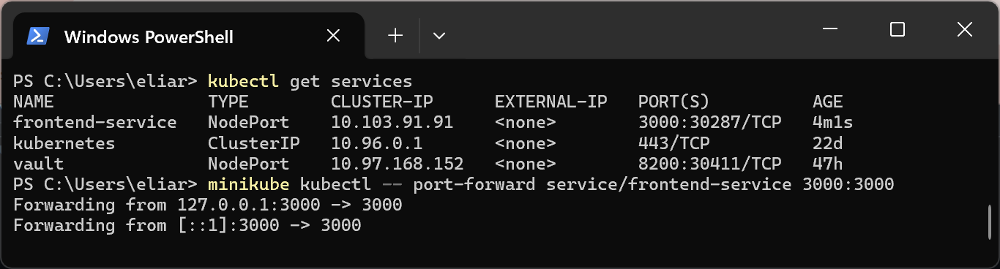
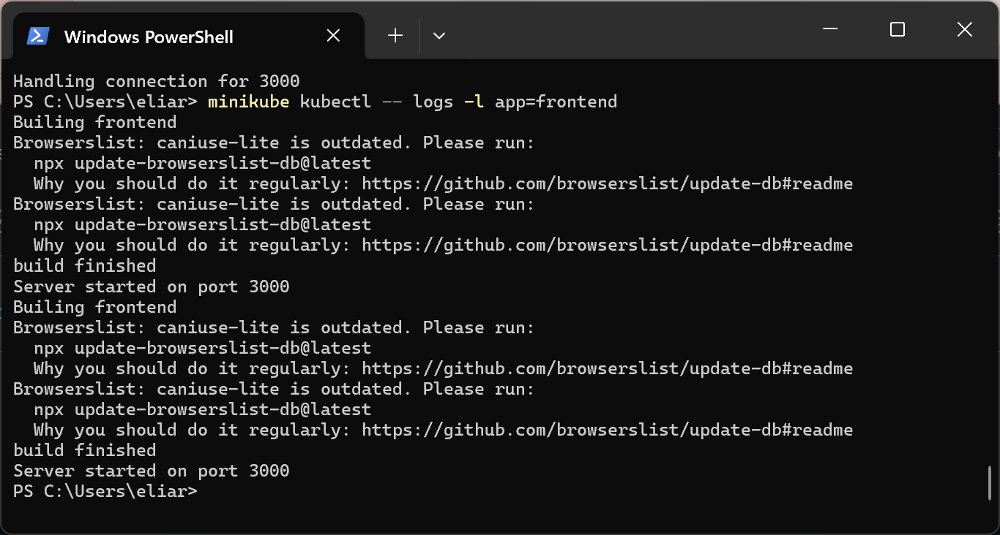

University: ITMO University Faculty: FICT Course: Introduction to distributed technologies Year: 2024 Group: K4112c Author: Romanova Elina Pavlovna Lab: Lab2 Date of create: 05.01.2024 Date of finished:

## Лабораторная работа №2 "Развертывание веб сервиса в Minikube, доступ к веб интерфейсу сервиса. Мониторинг сервиса."

### Цель работы

Ознакомиться с типами "контроллеров" развертывания контейнеров, ознакомится с сетевыми сервисами и развернуть свое веб приложение.

### Ход работы

1. Создать `deployment` с 2 репликами контейнера [ifilyaninitmo/itdt-contained-frontend:master](https://hub.docker.com/repository/docker/ifilyaninitmo/itdt-contained-frontend) и передать переменные в эти реплики: `REACT_APP_USERNAME`, `REACT_APP_COMPANY_NAME`.
2. Создать сервис через который будет доступ на эти "поды". Выбор типа сервиса остается на ваше усмотрение.
3. Запустить в `minikube` режим проброса портов и подключиться к контейнерам через веб браузер.
4. Проверить на странице в веб-браузере переменные `REACT_APP_USERNAME`, `REACT_APP_COMPANY_NAME` и `Container name`. Изменяются ли они? Если да то почему?
5. Проверить логи контейнеров, приложите логи в отчёт.

### Выполнение работы

#### 1. Создание Deployment

В Kubernetes Deployment — это объект, который управляет созданием и обновлением подов. Основная задача Deployment — гарантировать стабильное развертывание, обновление и возможность отката версий приложений.

[Конфигурационный файл](./deployment.yaml) содержит тип объекта `kind`, его идентификатор `name`, количество реплик `replicas`, а также спецификацю контейнеров, которая включается в себя образ `image`, имя контейнера `name`, и переменные окружения `env`.

Для создания объекта Deployment была использована следующая команда:

```bash
minikube kubectl -- apply -f deployment.yaml
```

После выполнения команды были созданы два пода и объект deployment.

#### 2. Создание сервиса

При помощи команды 

```bash
minikube kubectl -- apply -f service.yaml
```

создан сервер для управления.

#### 3. Проброс портов

Для проброса портов была выполнена следующая команда:

```bash
minikube kubectl -- port-forward service/frontend-service 3000:3000
```



#### 4. Проверка в браузере

Для проверки нужно открыть адрес `localhost:3000`:


Переменные `REACT_APP_USERNAME` и `REACT_APP_COMPANY_NAME` не изменяются, потому что они были заданы как переменные среды при создании объекта deployment. Эти переменные фиксированы в файле [deployment.yaml](deployment.yaml).

Переменная `Container name` может изменяться в зависимости от того, к какому контейнеру происходит переадресация из браузера. В данной работе переадресация происходила всегда к одному и тому же контейнеру.

#### 5. Проверка логов контейнера

Логи обоих контейнеров представлены ниже:


### Диаграмма организации

.png)
