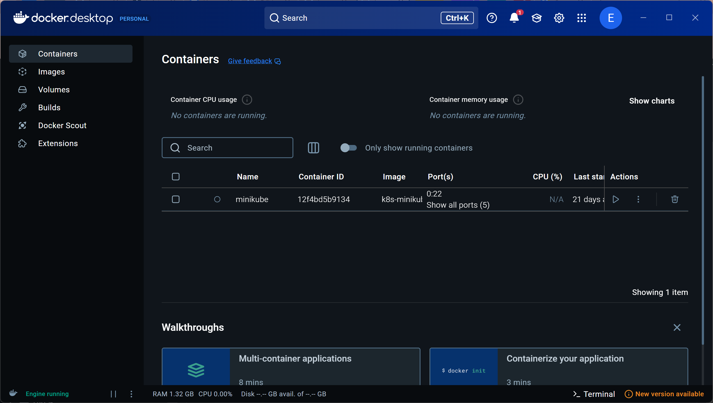
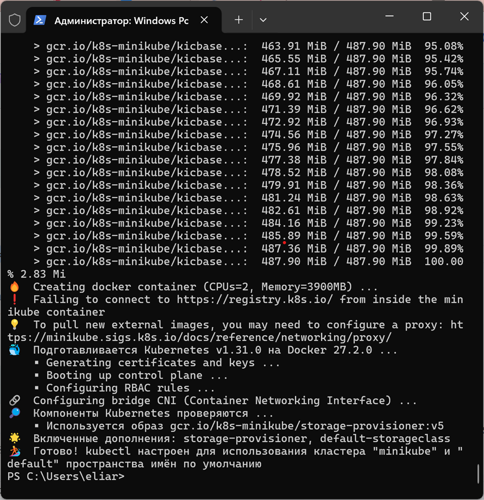
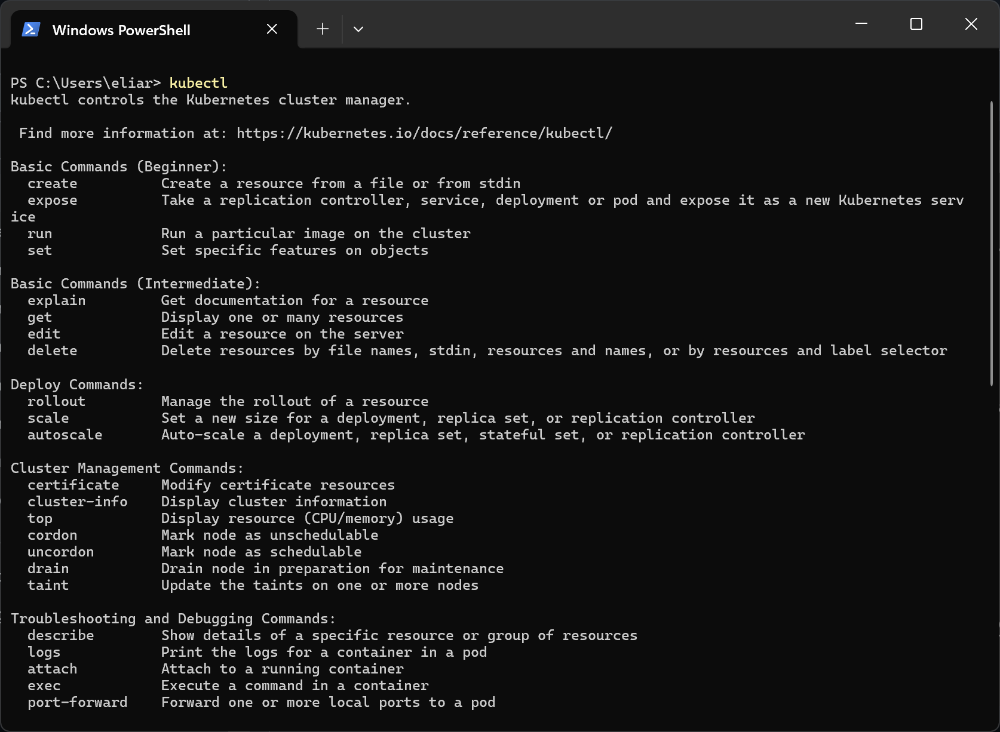
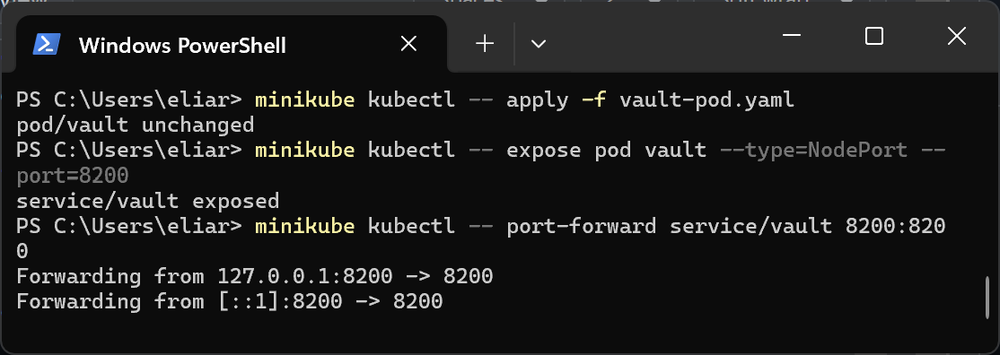
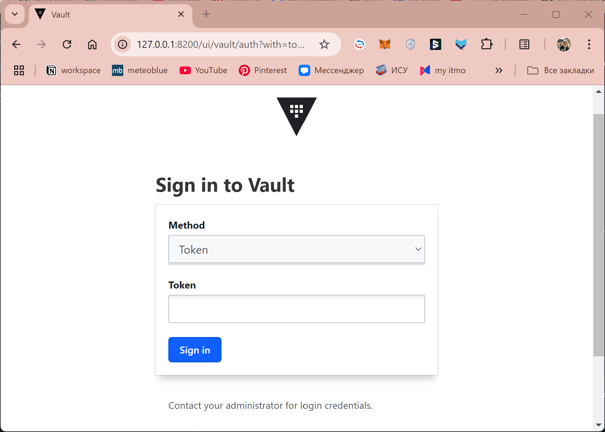

University: [ITMO University](https://itmo.ru/ru/)
Faculty: [FICT](https://fict.itmo.ru)
Course: [Introduction to distributed technologies](https://github.com/itmo-ict-faculty/introduction-to-distributed-technologies)
Year: 2024
Group: K4112c
Author: Romanova Elina Pavlovna
Lab: Lab1
Date of create: 12.12.2024
Date of finished: 

## Лабораторная работа №1 "Установка Docker и Minikube, мой первый манифест."

### Описание

Это первая лабораторная работа в которой вы сможете протестировать Docker, установить Minikube и развернуть свой первый "под".

### Цель работы

Ознакомиться с инструментами Minikube и Docker, развернуть свой первый "под".

### Ход работы

1. Установить Docker;
2. Установить Minikube;
3. Развернуть minikube cluster;
4. Скачать образ HashiCorp Vault;
5. Написать manifest для развертывания пода с образом HashiCorp Vault;
6. Создать сервис для доступа к данному контейнеру;
7. Прокинуть порт для доступа к контейнеру;
8. Найти токен для доступа к vault
9. Войти, используя токен.

### Выполнение работы

#### 1. Установка Docker

Docker — это инструмент, который помогает разработчикам и администраторам запускать и управлять приложениями в специальных контейнерах.

Контейнеры — это отдельные, изолированные пространства, где приложение работает вместе со всеми нужными ему компонентами, такими как библиотеки и настройки. Это позволяет приложению одинаково хорошо работать на любом устройстве или сервере.

Docker был скачен с официального сайта https://www.docker.com/ и установлен на Windows 11.


#### 2. Установка Minikube

Minikube — это программа, которая позволяет запустить Kubernetes прямо на компьютере. Она локально создаёт небольшой кластер из одного узла, где можно тестировать приложения, не настраивая сложные серверы или облачные системы.

Minikube был скачен с официального сайта https://minikube.sigs.k8s.io/docs/start/.

#### 3. Развертывание minikube cluster

Была использована следующая команда:

```bash
minikube start
```

Результат выполнения :


#### 4. Загрузка kubectl

Это основная утилита командной строки для управления кластером Kubernetes. Основные команды:

```bash

# Просмотр подов
kubectl get pods

# Просмотр сервисов
kubectl get services

# Создание деплоймента
kubectl create deployment name --image=image-name

# Просмотр логов пода
kubectl logs pod-name

# Удаление ресурса
kubectl delete pod/service/deployment name

# Применение конфигурации из файла
kubectl apply -f filename.yaml
```



#### 5. Создание сервиса для доступа к контейнеру

В начале нужно создать соотвествующей объект в кластере kurbernets, для этого используется следующая команда:

```bash
minikube kubectl -- apply -f vault-pod.yaml
```

Далее выполняется команда:

```bash
minikube kubectl -- expose pod vault --type=NodePort --port=8200
```

Данная команда создает сервис для пода vault. Сервис будет перенаправлять трафик на под vault через порт 8200. 

```bash
minikube kubectl -- port-forward service/vault 8200:8200
```

Результат выполнения команд:


После перехода по ссылке открывается интерфейс:

