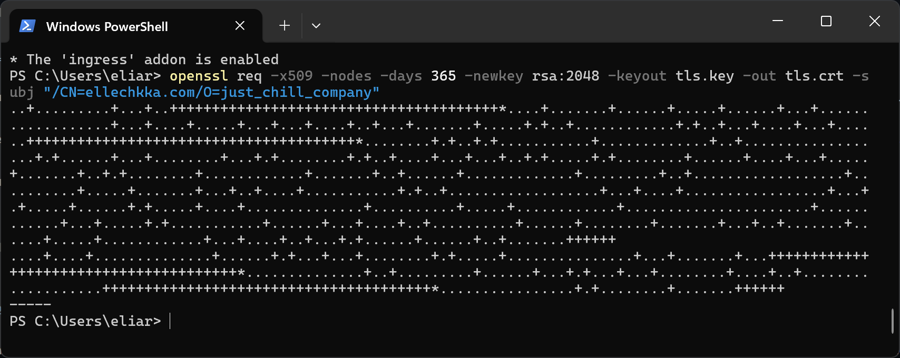

University: [ITMO University](https://itmo.ru/ru/)

Faculty: [FICT](https://fict.itmo.ru)

Course: [Introduction to distributed technologies](https://github.com/itmo-ict-faculty/introduction-to-distributed-technologies)

Year: 2024

Group: K4112c

Author: Romanova Elina Pavlovna

Lab: Lab3

Date of create: 05.01.2025

Date of finished: 

## Лабораторная работа №3 "Сертификаты и "секреты" в Minikube, безопасное хранение данных."

### Цель работы

Познакомиться с сертификатами и "секретами" в Minikube, правилами безопасного хранения данных в Minikube.

### Ход работы

1. Создать ConfigMap с переменными среды `REACT_APP_USERNAME` и `REACT_APP_COMPANY_NAME`;
2. Создать ReplicaSet с 2 репликами контейнера `ifilyaninitmo/itdt-contained-frontend:master`;
3. Включить Ingress и создать TLS-сертификат;
4. Создать Ingress, который будет использовать сервис и секрет с TLS-сертификатом;
5. Настроить `HOSTS`;
6. Проверка результатов.

### Выполнение работы

#### 1. Создание ConfigMap

Сначала создается конфигурационный файл [configmap.yaml](./configmap.yaml), в котором определяются значения для переменных среды: `REACT_APP_USERNAME` и `REACT_APP_COMPANY_NAME`.

После этого файл используется для создания объекта ConfigMap в Kubernetes с помощью следующей команды:

```bash
minikube kubectl -- apply -f configmap.yaml
```
#### 2. Создание ReplicaSet

ReplicaSet в Kubernetes управляет количеством реплик подов, обеспечивая их высокую доступность. Если под выходит из строя, ReplicaSet автоматически создаёт новый, чтобы поддерживать нужное количество реплик. В отличие от Deployment, ReplicaSet не поддерживает управление версиями, но используется для создания и управления подами в Deployment.

В конфигурационном файле [deployment2.yaml](./deployment2.yaml) описана конфигурация объекта ReplicaSet. В конце файла также указывается ранее созданный объект lab3configmap, который содержит переменные среды.

После создания файла объект ReplicaSet создается в Kubernetes с помощью команды:
```bash
minikube kubectl -- apply -f deployment2.yaml
```
#### 3. Включение Ingress и создание TLS-сертификата

Ingress — это объект Kubernetes, который обеспечивает внешний доступ к сервисам кластера, направляя HTTP(S)-запросы по заданным правилам (например, домены или пути).

Основные функции:

Маршрутизация: направляет запросы к нужным сервисам по URL или домену.
SSL/TLS: обеспечивает шифрование трафика с помощью сертификатов.
Балансировка нагрузки: равномерно распределяет запросы между репликами.

Для включения Ingress была выполнена следующая команда:

```bash
minikube addons enable ingress
```


TLS-сертификат обеспечивает шифрование соединений между клиентами и серверами, защищая передаваемые данные и подтверждая подлинность сайта или сервиса.

В Kubernetes TLS-сертификаты используются с Ingress для HTTPS-соединений. Сертификаты добавляются как Secret-объекты и подключаются к Ingress для шифрования трафика.

Для создания TLS-сертификата была выполнена следующая команда:

```bash
openssl req -new -newkey rsa:4096 -x509 -sha256 -days 365 -nodes -out MyCertificate.crt -keyout MyKey.key -subj "/CN=ellechkka.com"
```



Данная команда создает самоподписанный сертификат MyCertificate.crt и соответствующий ему закрытый ключ MyKey.key, привязанный к домену ellechkka.com.

