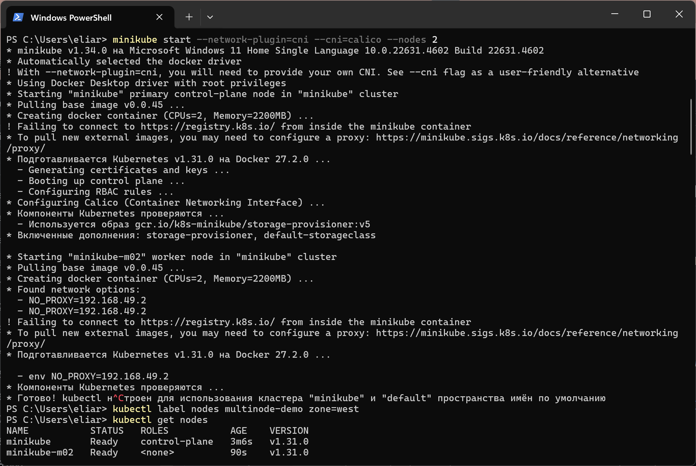
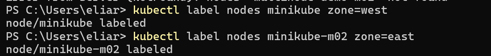
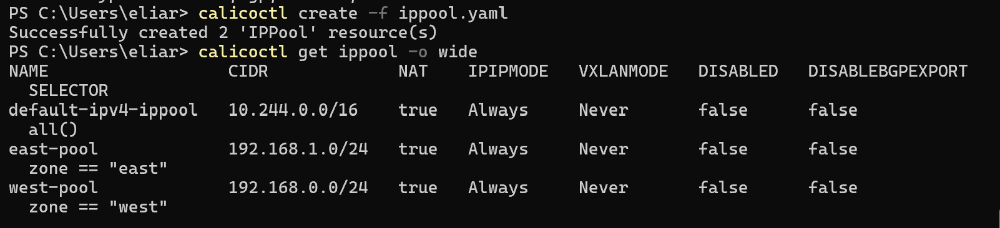
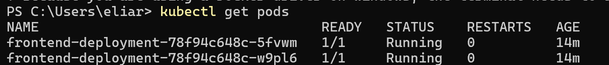
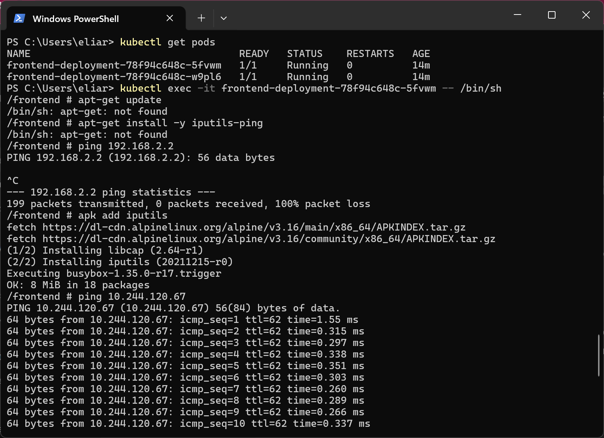
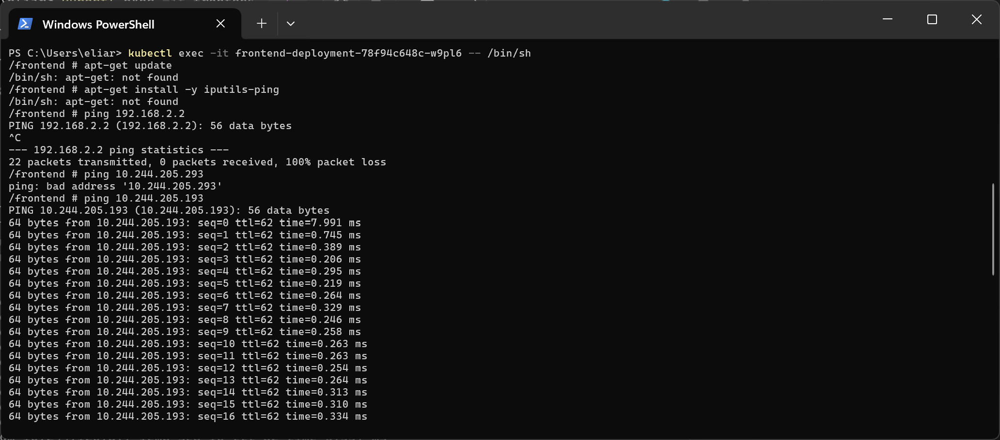
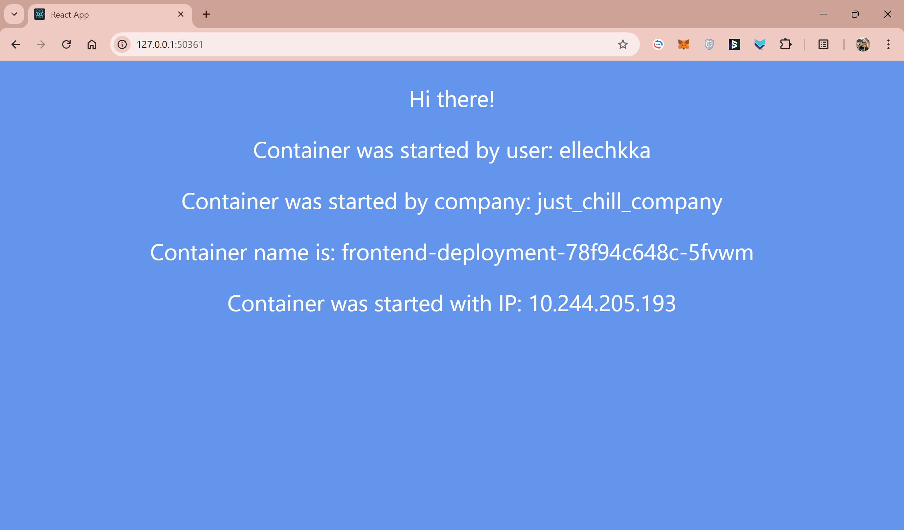

University: [ITMO University](https://itmo.ru/ru/)

Faculty: [FICT](https://fict.itmo.ru)

Course: [Introduction to distributed technologies](https://github.com/itmo-ict-faculty/introduction-to-distributed-technologies)

Year: 2024

Group: K4112c

Author: Romanova Elina Pavlovna

Lab: Lab4

Date of create: 08.01.2025

Date of finished: 

## Лабораторная работа №4 "Сети связи в Minikube, CNI и CoreDNS"

### Цель работы

Познакомиться с CNI Calico и функцией `IPAM Plugin`, изучить особенности работы CNI и CoreDNS.

### Ход работы

1. Запустить minikube вместе с плагином Calico;
2. Проверить работу CNI плагина Calico и количество нод;
3. Для запущеных ранее нод указать `label` по признаку стойки или географического расположения;
4. На основе ранее указанных меток назначить IP адреса "подам";
5. Cоздать `deployment` с 2 репликами контейнера [ifilyaninitmo/itdt-contained-frontend:master](https://hub.docker.com/repository/docker/ifilyaninitmo/itdt-contained-frontend) и передать переменные в эти реплики: `REACT_APP_USERNAME`, `REACT_APP_COMPANY_NAME`;
6. Создать сервис через который будет доступ на эти "поды";
7. Запустить в `minikube` режим проброса портов и подключиться к контейнерам через веб браузер;
8. Используя `kubectl exec` зайти в любой "под" и попробовать попинговать "поды" используя `FQDN` имя соседенего "пода", результаты пингов необходимо приложить к отчету

### Выполнение работы

#### 1. Запуск minikube

Запуск minikube был осуществлен с помощью следующей команды:

```bash
minikube start --network-plugin=cni --cni=calico --nodes=2
```

Команда настраивает Minikube для использования стандарта CNI (Container Network Interface) с сетевым плагином Calico, а также задаёт создание двух рабочих нод в кластере Kubernetes.

#### 2. Проверка работы



Поды и ноды успешно развернуты.

#### 3. Маркировка нод

Далее нодам был задан `label` на основании их условного георграфического расположения:


#### 4. Настройка Calico

Установлен инструмент calicoctl для работы с ресурсами Calico, а также установлены CRD для Calico с помощью манифеста calico.yaml.



Cоздается конфигурационной файл [deployment3.yaml](./deployment3.yaml), в нем задается тип объекта `kind`, его идентификатор `name`, количество реплик `replicas`, а также спецификация контейнеров, которая включается в себя образ `image`, имя контейнера `name`, и переменные окружения `env`.

Для создания объекта Deployment в Kubernates была использована следующая команда:

```bash
minikube kubectl -- apply -f deployment3.yaml
```

Далее аналогично был cоздан Service для приложения с помощью файла service2.yaml. Проверен статус подов с помощью kubectl get pods, все поды находятся в состоянии Running.

#### 5. Тестирование сетевого взаимодействия

В начале нужно узнать IP-адреса подов, делалось это с помощью следующей команды:


Затем к каждому из подов было осуществлено подключение и проверка доступности другого пода с помощью команды ping. Результат представлен ниже:


Из одного из подов был успешно установлен пинг до другого пода в том же кластере.

#### 6. Проверка работы

Успешно получен URL для frontend-service с помощью команды 

```bash
minikube service frontend-service --url -p minikube
```


